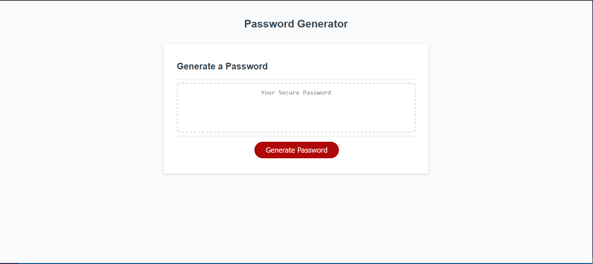

# Password Generator Starter Code (Module 3 Challenge)

## Description

This Random Password Generator will generate a random password between 8 and 128 characters selected by the user.  The user will also input whether they want a combination of Upper Case, Lower Case, Number, Symbol characters and generate the random password according to the user inputs.

## Table of Contents

- [Installation](#installation)
- [Usage](#usage)
- [Credits](#credits)
- [License](#license)

## Installation

N/A

## Usage

Preview of website layout and design.

## Credits

N/A

## License

Please refer to the LICENSE in the repo.

---